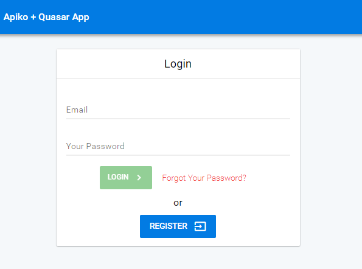
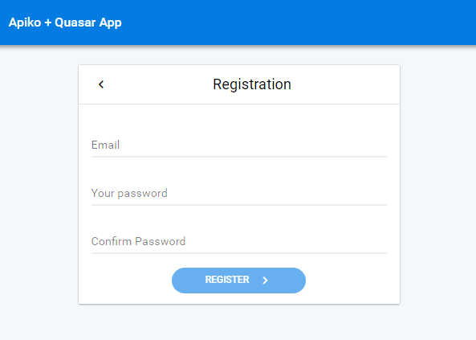
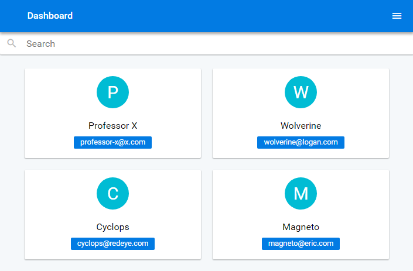
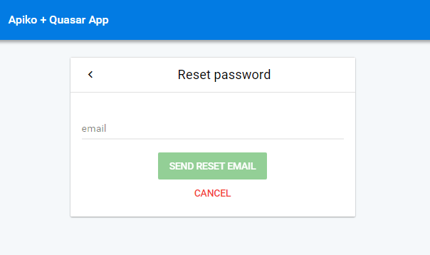

# Apiko + Quasar user app template

> An Apiko + Quasar tempalte for creating applications with already created user login, registration system & users management for admins.

## Features
- User login system with validation for email & password.
- User registration system with validation & dynamic check for unique login emails.
- Users management system for admins, like deleting & editing user settings.
- Easy searching for users management.
- User specific dashboard.
- Meta field in routes to differenciate whether pages should be viewed by only logged in users, only logged out users, only admins or any other users.
- A drawer used to show user's administrative links.
- A route to change account settings.
- Same code template as the quasar template so that you can do anything you do when using a quasar template.
- Vuex state saved to the local storage, to make the states persistent against browser refresh.
- Transition effects on route change.

## Build Setup

``` bash
# install dependencies
$ npm install

# serve with hot reload at localhost:8080
$ quasar dev

# build for production with minification
$ quasar build

# lint code
$ quasar lint
```

## Usage

You should change your base api url in src/api/index.js to your api address.
```bash
axios.defaults.baseURL = 'your api address'
```

## route security
You can use onlyLogged, onlyNotLogged or onlyAdmin meta fields inside any route to control who can view your routes.
1. Use onlyLogged = true for those routes you want only logged in users to view.
``` 
{ name: 'dashboard', path: 'dashboard', component: load('dashboard'), meta: { onlyLogged: true } },
```
2. Use onlyNotLogged = true for those routes you want only not logged in users to view.
```
{ name: 'login', path: 'login', component: load('login'), meta: { onlyNotLogged: true } }
```
3. User onlyAdmin = true for those routes you want only admins users to view.
```
{ name: 'usersManagement', path: 'users-management', component: load('usersManagement'), meta: { onlyAdmin: true } }
```
4. You can omit those fields to make the route accessible by anyone.

## Screenshots

### Login



### Registration


### Users Management


### Password Reset
